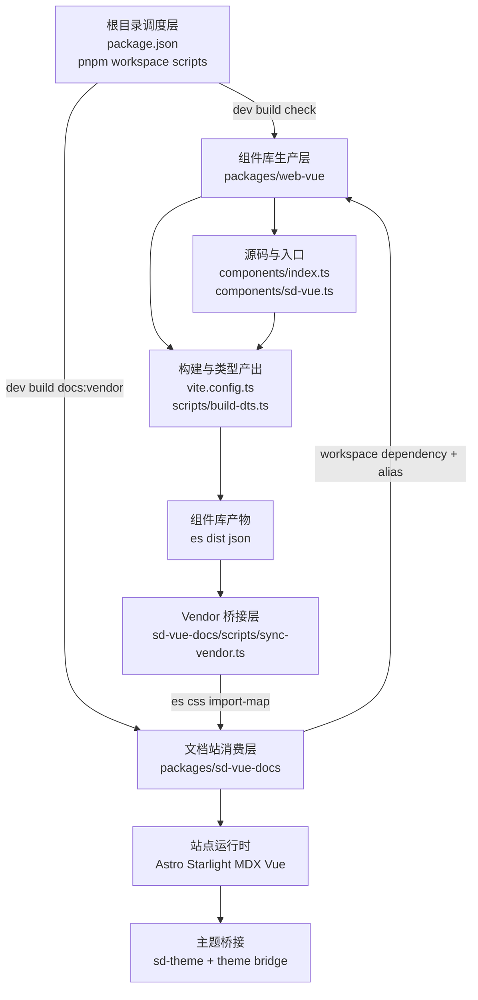
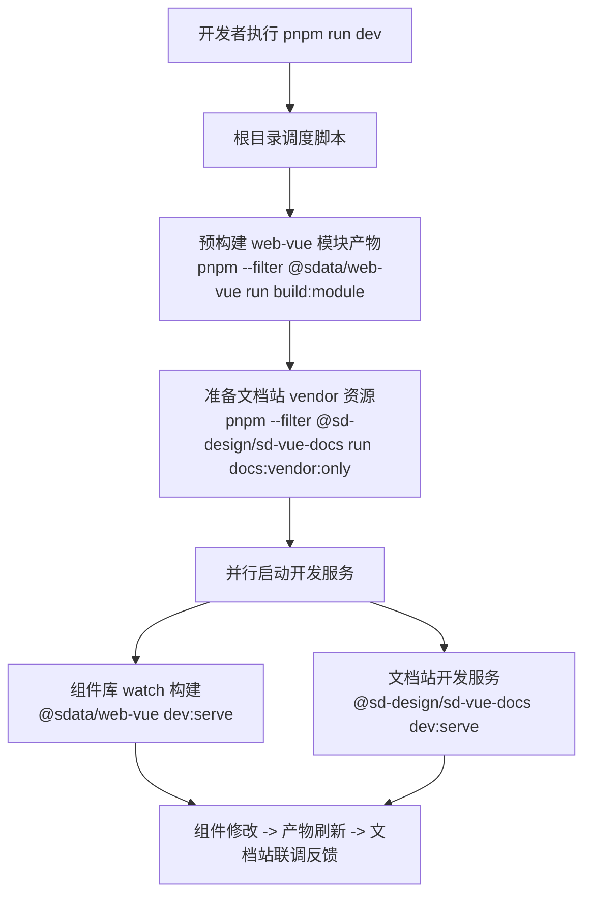
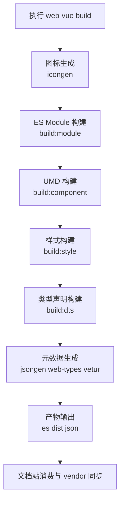

# SD Design 前端架构说明

## 总览

以 `packages/web-vue` 为核心产物、以 `packages/sd-vue-docs` 为消费与展示层的双包协同架构。

- 根目录负责统一调度开发、构建、校验和发布前检查。
- `packages/web-vue` 负责组件源码、样式、类型声明和 IDE 元数据产出。
- `packages/sd-vue-docs` 负责文档页面、在线示例、主题桥接和站点构建。
- `packages/sd-mcp` 负责把组件 API 元数据封装为 MCP 服务，供 AI 助手查询。

## TypeScript 源码与运行边界

项目维护的所有业务与工具源码使用 `.ts` / `.mts` / `.tsx`，包含文档站的 Astro 配置、集成、生成与同步脚本，以及 MCP、自动导入解析器、发布配置。Vue 组件逻辑使用 `<script setup lang="ts">`；纯模板组件无需增加空脚本。模块级计数器和常量放入独立 TS 模块，保留各组件实例共享状态的语义。

Node 24 直接执行维护脚本，以 `tsconfig.scripts.json` 的 `NodeNext`、`strict`、`erasableSyntaxOnly` 和 `verbatimModuleSyntax` 约束原生可执行语法。脚本导入写明 `.ts` / `.mts` 扩展名，类型导入使用 `import type`。Node 运行时只擦除类型，不负责检查。根目录 `typecheck` 依次检查生成准备、源码约定、脚本、Vue 工作区、MCP 和解析器，统一使用精确锁定的 TS7/TNB。

提交交互使用 `czg`，通过 `pnpm cz` 启动；中文提示、提交类型和 emoji 与校验规则集中在 `commitlint.config.ts`。依赖升级使用现有 `pnpm update` 流程，不保留 npm-check-updates 配置。编译后的 `es` / `dist`、文档站同步的 `public/vendor`、第三方依赖与外部技能包使用上游或目标运行环境需要的格式，不作为维护源码转换。浏览器内联脚本和 REPL 生成内容同样需要输出可执行 JavaScript。REPL 根据浏览器运行时清单生成的值导出声明仍使用动态类型占位：该清单仅记录导入路径，不包含泛型函数和组件值的完整签名；这些沙箱声明不参与工作区源码检查。

`.gitattributes` 将 `.agents/**` 与 `.claude/**` 标记为第三方代码，整个目录不参与 GitHub 语言统计。

类型边界使用 `unknown` 和明确的数据结构；第三方未公开的运行时接口（例如 Day.js `$utils`）在调用边界描述最小结构。虚拟列表和 List 通过 Vue 泛型传播项类型，泛型组件的公开实例类型通过 `ComponentExposed` 提取，提供该类型的 `vue-component-type-helpers` 随组件库作为正式依赖发布。

## 模块关系图

## 技术栈

- Monorepo：`pnpm workspace`
- 组件库：`Vue 3`、`TypeScript`、`Vite`、`vite-plus`；内容裁剪内核统一依赖 `vue-clamp`
- 文档站：`Astro`、`Starlight`、`MDX`、`@astrojs/vue`
- 样式体系：`scss` + 组件样式入口 + 文档站 vendor CSS 同步
- 质量保障：`Cypress`、Node 内置测试运行器、`oxlint`、`oxfmt`、`stylelint`
- AI 集成：`MCP`（`@modelcontextprotocol/server` v2）+ `tsdown` 构建；组件元数据由 `vue-docgen-api` 与 TypeScript 编译器 API 从源码及已有类型契约提取

## 模块分层

### 根目录调度层

根目录 `package.json` 是整个仓库的流程中枢。它不承载业务实现，而是负责把两个核心包串起来。

- `dev` / `dev:all`：组织组件库预构建、文档站 vendor 准备和双服务并行启动。
- `build` / `build:all`：组织组件库构建与文档站构建。
- `check` / `check:ci` / `release:check`：统一格式、lint、测试和全量构建校验。

这个设计的重点是让开发和 CI 都从 monorepo 根入口起跑，减少各包脚本分散维护带来的偏差。

### 组件库生产层

`packages/web-vue` 是仓库的核心生产者，负责生成可发布、可类型检查、可文档消费的组件库产物。

- `components/index.ts`：按需导出入口。
- `components/sd-vue.ts`：全量安装插件入口。
- `components/clamp`：不增加包装 DOM，原样别名导出 `vue-clamp` 的四个裁剪原语；`Ellipsis` 和响应式标签/菜单等既有组件复用这些原语，不再维护独立测量算法。
- `components/trigger` 与 `components/tour`：锚点型悬浮层统一通过 `@floating-ui/vue` 定位；各公开组件的 `floatingOptions` 类型直接继承上游 `UseFloatingOptions`，运行时不维护参数白名单。
- `components/markdown-render`：以精确锁定的 `markstream-vue@2.0.13` 为渲染内核的二次封装，承担流式解析、虚拟化调度和重节点渲染。节点映射与样式分层约定见「Markdown 渲染分层」。
- `vite.config.ts`：定义模块构建、UMD 构建、样式构建和测试支持配置。
- `scripts/build-dts.ts`：负责类型声明构建和复制。
- `json/`：承载 web-types、vetur 等 IDE 元数据。

这个包的职责不只是“把 Vue 组件编译出来”，而是同时服务四类场景：

- 业务项目按需引入
- 浏览器直连或 UMD 消费
- TypeScript 类型系统
- IDE 智能提示与元数据消费

### Markdown 渲染分层

`components/markdown-render` 把上游 Markstream 的流式解析、虚拟化调度和重节点引擎原样接入，用 SD 组件和 token 替换表现层。约束有三条，都是实测得出的，改动前需要复核：

- **属性不设默认值。** `MarkdownRenderProps` 直接使用上游 `NodeRendererProps`，封装不为任何属性复制默认值；`withDefaults` 里显式写 `undefined` 的布尔属性是为了让「未传」保持未传（SFC 编译器会把 `flag?: boolean` 编译成 `type: Boolean`，Vue 的布尔 casting 会把未传读成 `false`）。`isDark` 未传时跟随 SD 主题。
- **默认节点映射不能注册 `paragraph`。** 上游 `ListItemNode` 只判断注入的映射表里有没有该子节点类型的键：有键就放弃轻量行内路径，改为给每个列表项 spawn 一个完整嵌套渲染器，代价是约 2/3 的额外 DOM、被撑破的 `maxLiveNodes` / `liveNodeBuffer` 预算，以及嵌套 `data-node-index` 与父级索引空间冲突。其余键（标题、引用、链接、图片、复选框、行内代码、分隔线、提示块、原始 HTML）不触发该分支，正常替换为 SD 组件。段落改由 `style/index.scss` 的 `.paragraph-node` 规则和 `--ms-*` 变量入口用 SD 正文 token 对齐观感。`components/markdown-render/__test__/perf.cy.ts` 用真实长文档守住这条边界，`nodes/index.ts` 有注释禁止补回。
- **默认映射通过 `app.provide` 桥接，不写全局状态。** `context.ts` 以 Proxy 拦截 `VueRendererMarkdown.install` 的 `app.component` 与 `app.provide`，把上游插件的 app 级下发收敛为当前子树的 `provide`，因此多实例、卸载、路由切换和 SSR 都不会串扰。桥接依赖上游三条实现细节，任一变化会让映射静默失效，dev 下有显式告警。

样式分层为 `@layer sd-design, markstream`：现有 reset 留在 `sd-design`，上游 CSS 整份收进 `markstream`，SD 组件与 Markdown 适配规则保持未分层因而优先。上游 CSS 由 `scripts/sync-markstream-style.ts` 从锁定依赖生成并可重复执行；生成时把上游 Tailwind 残留的未作用域 `.container` 工具类收敛进 `.markstream-vue`，避免全量 CSS 把全局工具类带进消费方应用。

锁定版本的根渲染器不提供插槽，因此 `MarkdownRender` 不转发具名插槽，代码块头部等节点级插槽需通过整体替换 `code_block` 节点组件接管。完整契约、节点清单和实测数据见 `components/markdown-render/COMPATIBILITY.md`。

### 文档站消费层

`packages/sd-vue-docs` 不是单纯的 markdown 渲染器，而是组件库的首个真实消费方。

- 使用 Astro + Starlight 组织文档页面与站点结构。
- 使用 `@astrojs/vue` 承载 Vue 示例组件。
- 通过 workspace 依赖直接消费 `@sdata/web-vue`。
- 通过 Vite alias 直接指向组件库源码和样式目录，以保证示例与实现一致。

### MCP 服务层

`packages/sd-mcp` 是面向 AI 助手（Claude Code、Codex、VS Code Copilot 等）的组件元数据服务，让 AI 在编码时能查询到组件真实的 API。

- 基于 `@modelcontextprotocol/server` v2 的 `McpServer` 与 `serveStdio` 提供 stdio MCP 服务，支持 `2026-07-28` 协议并兼容旧版握手，bin 名为 `sd-design-mcp`。
- `data/components.json` 为生成的静态数据，不提交 Git，由 `scripts/gen-component-data.ts` 生成：组件清单、分类与标题来自文档站侧边栏与各组件 MDX frontmatter，Props / Events / Slots 由 `vue-docgen-api` 从 `web-vue` 组件源码提取，导入的运行时 props、第三方类型和服务 API 由 `scripts/type-api.ts` 从公开导出、SFC `defineProps` 及现有类型命名约定自动发现契约并补齐。构建时由 `tsdown` 内联进 `dist/index.js`。
- 常规 SFC 沿用 `web-types` 的 docgen 提取方式；MCP 额外保留补齐契约中缺少描述的字段。Message / Notification 返回服务配置与方法，没有同名组件的文档分组按真实公开导出自动展开；Clamp 文档展开为四个真实导出组件。
- 该包独立构建与测试（`pnpm --filter @sdata/web-vue-mcp run build` / `gen` / `test`），不参与根目录的 `dev` / `build:all` / `check:ci` 流程，避免影响组件库主链路。

### Vendor 桥接层

`packages/sd-vue-docs/scripts/sync-vendor.ts` 是当前架构里非常关键的一层。

它会把组件库产出的浏览器可消费资源同步到文档站的 `public/vendor`，主要包括：

- `packages/web-vue/es` 模块产物
- 组件库样式编译结果
- 浏览器依赖 bundle
- import map

这层存在的意义，是把“组件源码/构建产物”和“文档站浏览器运行环境”隔离开。凡是在线编辑器、浏览器端模块加载、示例样式失真等问题，都应优先检查这里。

## 关键流程

## 开发流程图

## 构建流程图

### 本地开发流程

根目录 `pnpm run dev` 的实际语义不是简单地“起两个服务”，而是分成三步：

1. 先构建 `web-vue` 的模块产物。
2. 再同步文档站 vendor 资源。
3. 最后并行启动组件库 watch 构建和文档站开发服务。

这个顺序说明文档站并不独立，它依赖组件库的最新构建结果和同步出的浏览器资源。

### 组件库构建流程

`packages/web-vue` 的构建大体分为：

1. 图标生成
2. ES Module 构建
3. UMD 构建
4. 样式构建
5. 类型声明构建
6. `web-types` 等 IDE 元数据生成

排查构建失败时，应该先区分失败点属于资源生成、打包、样式编译还是类型产出，而不是笼统地看作“build 挂了”。

### 文档站构建流程

文档站的 `dev`、`build`、`preview` 都会先执行 `docs:vendor`。这意味着：

- 文档站能否稳定运行，依赖 vendor 资源是否已准备好。
- 示例异常不一定是页面内容问题，也可能是 vendor 产物过期或缺失。

### 主题联动流程

文档站在 Astro 配置里注入 theme bridge 脚本，监听站点主题切换并同步 `body` 上的 `sd-theme` 属性。

这说明站点主题系统和组件库主题系统不是天然共用一套运行时状态，而是通过桥接脚本显式同步。暗色模式异常、局部浮层主题不一致等问题，优先检查这层同步。

### 主题目录与运行时覆盖

主题链路为 `style/token.scss → scripts/theme-catalog.ts → CSS 变量回退 + theme-catalog.json → ConfigProvider / 文档编辑器`。

主题 seed 的明暗色阶由 SD Design 本地 TypeScript 算法生成，组件库及在线编辑器无需加载 Arco Design 包。

- 全局基础值通过 `seed` 派生色阶、圆角、字号和控件高度；`algorithm` 保存暗色和紧凑选项，显式 `themeMode` 优先于暗色算法。
- ThemeProvider 按最终有效模式派生 seed：显式模式 → 暗色算法 → 父 Provider / DOM 主题；compact 不覆盖明暗。内置预设只存 seed、尺寸和算法，避免将浅色背景/中性色作为显式覆盖带入暗色模式。用户显式 token 的优先级保持不变。
- `tokens` 覆盖派生值，归一化后注入 `--<token>`。全局 Sass 样式通过 `--sd-<token>: var(--<token>, 默认值)` 连接既有样式协议。局部主题边界重新计算语义别名，浮层容器同步继承配置。
- 组件样式变量回退链是 `--component-<组件>-<完整token> → 简写别名 → 全局值/组件默认值`。原有 `components.button.borderRadius` 继续可用；编辑器展示完整名称以避免歧义。
- 生成器扫描组件目录，排除 Sass 控制流、算术依赖和非 CSS 标量，输出实际可调目录与直接依赖。仍需编译期数值的字段不作为可调字段展示；迁移其消费者到 CSS `calc()` 后可被自动收录。
- 生成块在 Sass 原始定义之后应用，保留原始定义用于编译和生成；重复执行保持稳定。新增组件按同样目录约定即可收录。正常启动/构建通过 `icongen` 前置生成，运行中的开发进程新增 token 后执行 `theme:generate` 更新目录。
- 文档编辑器的字段来自生成目录，示例通过 `import.meta.glob('../generated/*/*.vue')` 延迟加载。新增组件无需修改编辑器名单，也不依赖 vendor 的 React 运行时。
- 页面预览由 `ThemePagePreview` 注入主题，`ThemeWorkspacePage` 提供可交互的交付工作台；预览颜色只消费组件库 token，不依赖 Starlight。`ThemePreviewCanvas` 使用 SVG `g` 矩阵与 `foreignObject` 承载 HTML，`usePreviewCanvas` 通过 VueUse 管理平移、锚点缩放、尺寸观察和监听清理。下拉框使用 ConfigProvider 的主题浮层容器；示例的 Modal/Drawer 单独 Teleport 到 body 内的主题边界并关闭二次 Teleport，避免画布裁剪和默认 body 主题影响，不改变组件库的默认弹窗行为。
- 导入由公共 `parseThemeConfig` / `validateThemeConfig` 校验；失败不覆盖当前配置。空对象表示恢复默认主题，基础、高级和组件覆盖可往返序列化。

生成器测试使用临时目录添加未来组件，检查发现与幂等性；Cypress 验证真实样式、主题隔离和编辑/导入导出流程。

### 质量门禁流程

根目录的 `check`、`check:ci` 和 `release:check` 把格式化检查、lint、测试和全量构建串成统一质量门。

这套设计的意图很明确：所有最终要进主干或发版的改动，都应该经过根目录级别的统一校验，而不是只在单包里做局部验证。

## 上手建议

如果刚接触这个仓库，按下面顺序理解最快：

1. 先看根目录 `package.json`，理解统一入口有哪些。
2. 再看 `packages/web-vue`，明确组件库是如何产生产物的。
3. 再看 `packages/sd-vue-docs`，理解文档站如何消费组件库。
4. 最后看 vendor 同步脚本和主题桥接，理解联调时为什么会出现跨包问题。

## 维护者排障索引

- 文档站能启动，但示例不对：先看 vendor 同步层和 `packages/web-vue/es` 是否最新。
- 暗色主题或浮层样式异常：先看 theme bridge 和组件主题运行时同步。
- 构建失败：先分辨是图标、模块、样式、类型还是元数据阶段出错。
- 单包测试通过但根流程失败：优先回到根目录入口复现，确认是否是跨包联动问题。
- 文档内容正常但浏览器端 import 失败：优先检查 import map 和 vendor 依赖 bundle。

## 架构判断

- 这个仓库的核心不是单纯维护组件源码，而是维护一条完整的前端交付链：组件实现、样式体系、类型声明、IDE 元数据、文档渲染和在线示例运行时都在同一仓库内闭环。
- `packages/web-vue` 是生产者，`packages/sd-vue-docs` 是首个消费者，两者通过 workspace 依赖、源码别名和 vendor 同步三层机制耦合。这样做的好处是文档与真实组件实现不容易漂移，代价是任何构建链路变更都需要同时考虑文档站联动。
- 根目录脚本故意保持“少而统一”，说明这个仓库当前更强调稳定协作和可预测流程，而不是把构建职责分散到更多内部工具包中。
